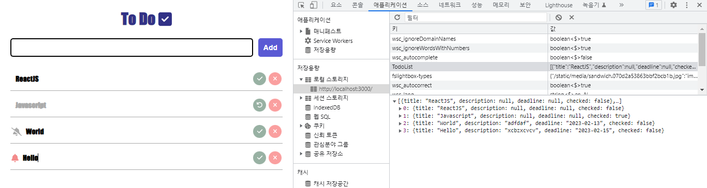
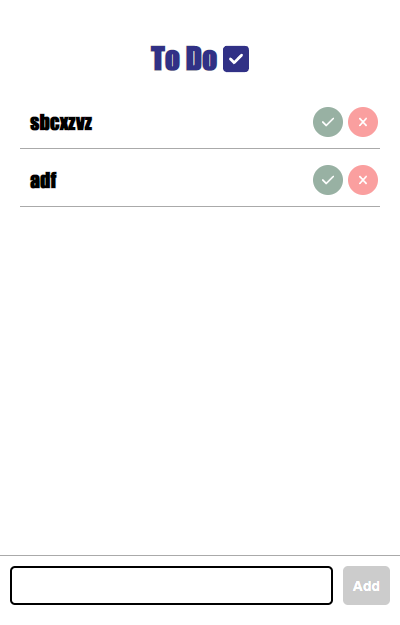
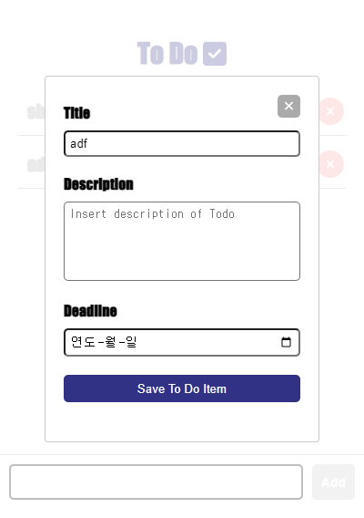
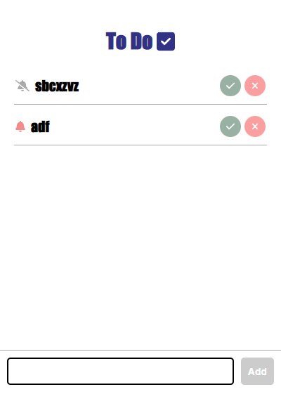

# todolist
Side project - To do list 
Example site link: https://sqhtjs0104.github.io/todolist/

> Created at 2023-02-13 16:30 
> Completed at 2023-02-14 18:50 
> Deployed on gh-pages at 2023-02-14 19:10

## Libraries
- styled-component
- lodash
- fontawesome
- react-modal
- dayjs
  
## Skills
- HTML5/CSS3
- SASS
- ReactJS
- Javascript

## About
간단한 TodoList 사이트입니다. 
입력 후 목록을 클릭하여 설명과 기간을 정할 수 있고, 
남은 기간에 따라 3일 미만, 만료 상태를 아이콘으로 표시합니다. 
완료 시 CSS 변경 및 삭제 시 목록에서 사라지며, 
localStorage를 활용해 브라우저가 종료되어도 목록이 유지됩니다.

## Screenshot

